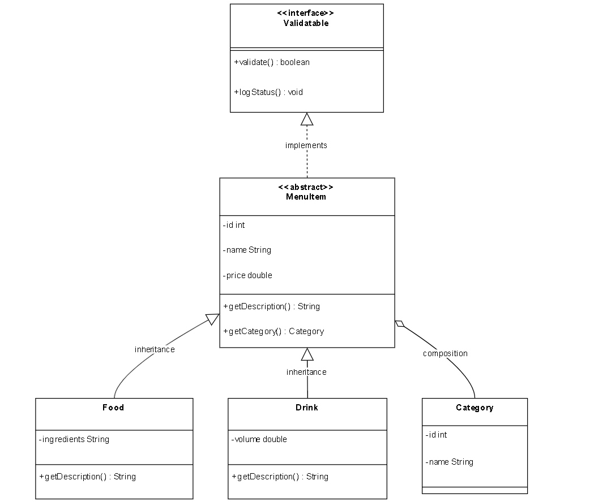
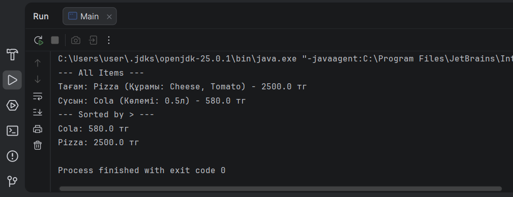
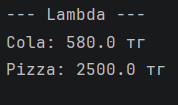

# Assignment 4: SOLID Restaurant System

## 1. SOLID Principles
* **SRP (Single Responsibility Principle):** The project is divided into layers: controller for user interaction, service for business logic and validation, and repository for database operations.
* **OCP (Open-Closed Principle):** New menu item types like Food and Drink are added by extending the MenuItem abstract class without modifying existing code.
* **LSP (Liskov Substitution Principle):** Subclasses (Food, Drink) can replace the base class (MenuItem) without breaking the application logic.
* **ISP (Interface Segregation Principle):** The Validatable interface is focused only on data verification, avoiding bloated interfaces.
* **DIP (Dependency Inversion Principle):** MenuItemService depends on the CrudRepository interface instead of a specific PostgreSQL implementation.

## 2. Advanced OOP Features
* **Generics:** The CrudRepository<T> interface uses generics to work with different entity types.
* **Lambdas:** A lambda expression is used in MenuItemService to sort the menu items by price.
* **Reflection:** ReflectionUtils class uses RTTI to inspect class names, fields, and methods at runtime.
* **Interface Methods:** The Validatable interface includes a default method for status logging and a static method for numeric validation.

## 3. OOP Documentation
* **Abstract Class:** MenuItem serves as the base entity for all products.
* **Subclasses:** Food (with ingredients) and Drink (with volume) implement the abstract methods of MenuItem.
* **Polymorphism:** Different descriptions are displayed for Food and Drink through method overriding.

## 4. Database Section
* **Schema:** PostgreSQL table named "menu_items".
* **Columns:** id (SERIAL), name (VARCHAR), price (DOUBLE), type (VARCHAR), extra_info (TEXT).
* **JDBC:** Implementation uses PreparedStatement for secure database interactions.

## 5. Architecture
* **Controller:** Handles CLI input and delegates tasks to the service.
* **Service:** Implements business rules and handles exceptions.
* **Repository:** Manages CRUD operations via JDBC.

## 6. Execution Instructions
1. Create a database "restaurant_db" in pgAdmin.
2. Run the SQL script to create the "menu_items" table.
3. Add the PostgreSQL JDBC driver to the project libraries.
4. Run the Main class to see the demonstration.

## 7. Screenshots & Evidence
### Project Class Diagram (UML)

### Reflection API Output

### Lambda Sorting Result
